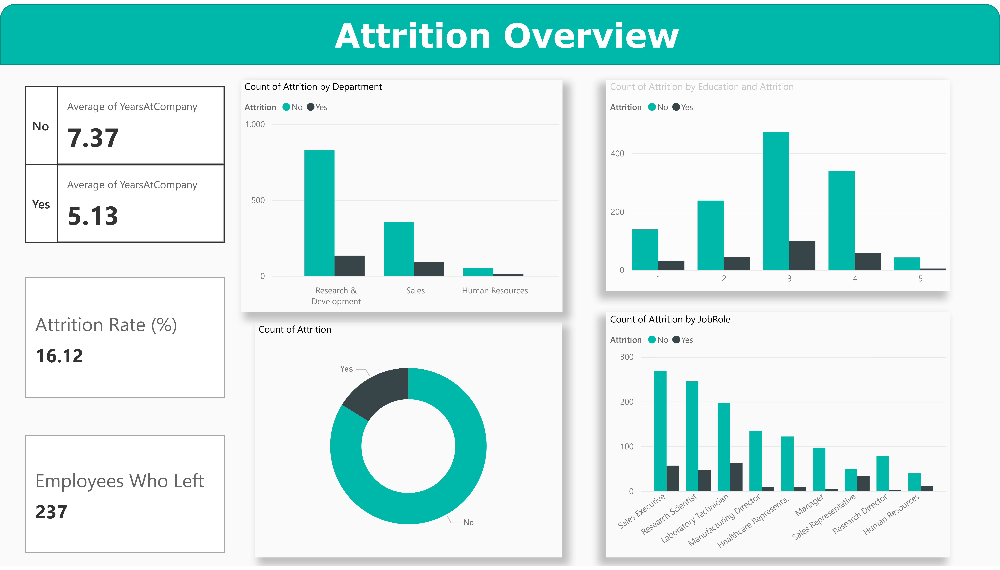
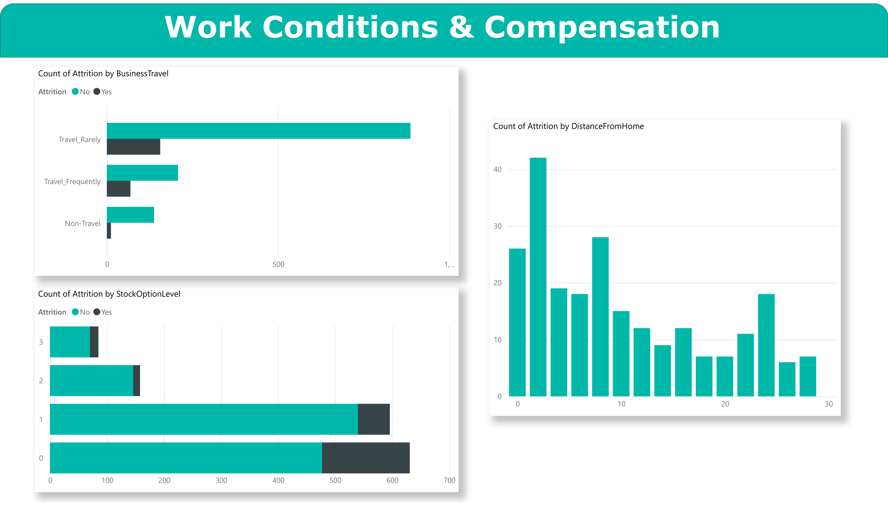
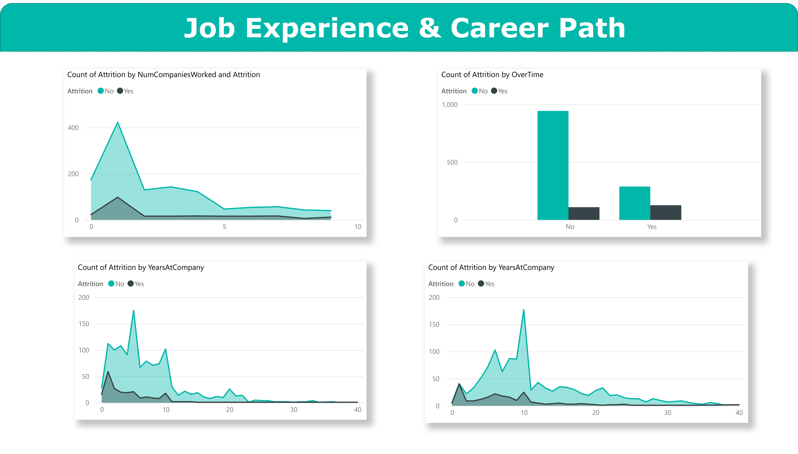
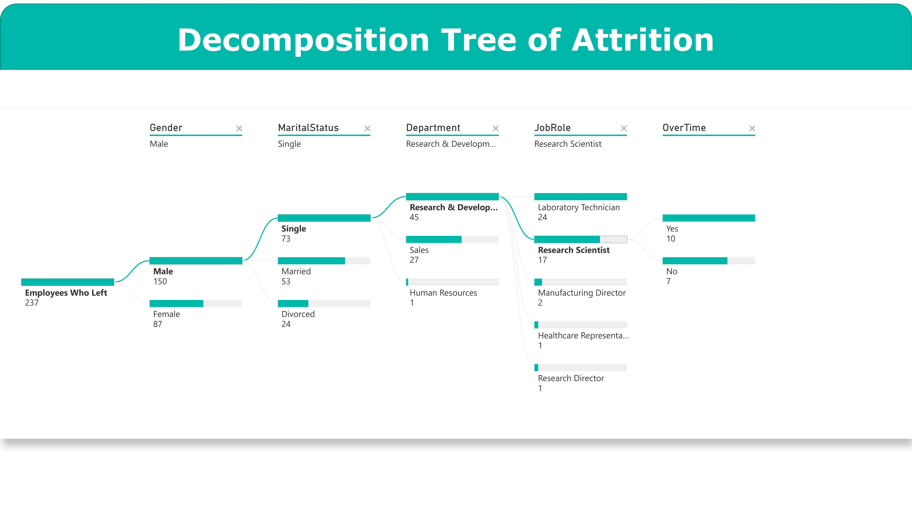

# Employee Attrition Analysis

This project provides a comprehensive analysis of employee turnover using the IBM Employee Attrition dataset. By leveraging data visualization, the report identifies key drivers behind attrition and offers actionable, data-driven recommendations to improve organizational retention.

## Visualization Preview

	<table>
		<tr>
			<td>
				 
			</td>
			<td>
				 
			</td>
		</tr>
		<tr>
			<td>
				 
			</td>
			<td>
				 
			</td>
		</tr>
		<tr>
			<td>
				 
			</td>
		</tr>
	</table>

## Project Overview

The primary objective of this study is to uncover patterns related to employee turnover by investigating factors such as job roles, educational backgrounds, and gender. High attrition poses significant financial burdens—often costing up to half of an employee's annual salary—and can reduce organizational profitability by approximately 23%.

## Dataset Summary

The analysis utilizes a fictional dataset created by IBM data scientists, consisting of **1,470 observations** and **35 variables**.

- **Key Features:** Age, Business Travel, Department, Distance from Home, Education, Job Satisfaction, Overtime, Stock Option Level.
- **Mappings:** Categorical fields (e.g., Environment Satisfaction, Work-Life Balance) scaled from 1 (Low/Bad) to 4 (Very High/Best).

## Key Insights

- **Overall Rate:** The company’s overall attrition rate is **16.12%**.
- **High-Risk Tenure:** Employees are most likely to leave within their first **1–3 years**.
- **Demographic Vulnerability:** Single male employees in R&D (Research Scientists, Laboratory Technicians) show high attrition.
- **Work Conditions:** Strong correlation between **overtime work** and increased turnover.
- **Compensation:** Employees with **no stock options** (Level 0) are more likely to leave.

## Proposed Solutions

Based on the visual analysis, the following strategies are recommended:

1. **Onboarding Initiatives:** Structured mentoring for the first 12–24 months of employment.
2. **Workload Management:** Monitoring to flag and limit excessive overtime.
3. **Equity Expansion:** Offer stock options to non-executive and mid-level staff.
4. **Predictive Modeling:** Build internal risk models to identify and support at-risk employees.

## Contributors

This project was presented our team at the Institute of Technology of Cambodia, Department of Applied Mathematics and Statistics.

- Lecturer: **Dr. PHAUK Sokkhey**
- Team Members:
  - **Phoeun Rajame**
  - **Phoeurn Kimhor**
  - **Sek Somunineath**